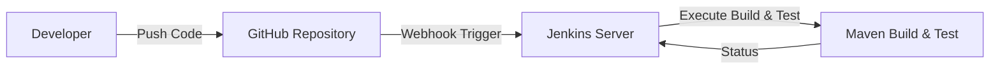
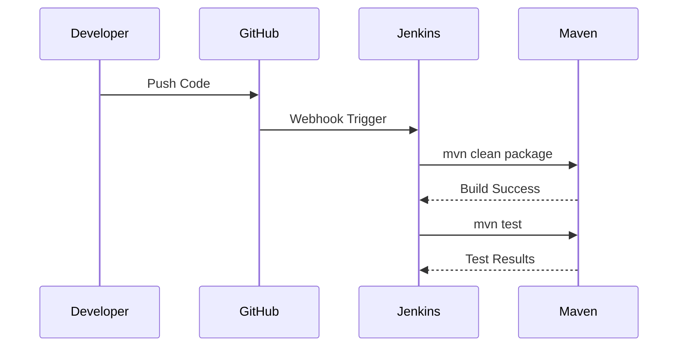

# 🚀 Maven CI/CD Pipeline with Jenkins & GitHub

An **ultra-professional, beginner-friendly CI/CD project** demonstrating how to build, test, and automate a **Maven application** using **Jenkins** and **GitHub Webhooks** — starting from a **local directory on the same Jenkins server**.

> **Author:** Prasad Bhoite  
> **Role:** Cloud & DevOps Engineer (Fresher)  
> **Tech Stack:** Java · Maven · Jenkins · GitHub · Linux (Ubuntu)

---

## 📌 Project Overview :-

This project demonstrates a **real-world DevOps CI/CD workflow**:

1. Design a **Maven application**
2. Deploy source code **locally on the Jenkins server**
3. Perform an initial **Maven Build**
4. Push the code to **GitHub**
5. Configure **GitHub Webhook Trigger** in Jenkins
6. Automatically run **Maven Build**
7. Trigger **Maven Tests only after successful build**

🎯 Goal: Understand **end-to-end CI/CD automation** with clarity and confidence.

---
## 🔐 Jenkins Credentials Management

To securely integrate Jenkins with GitHub and other services:

- Store GitHub credentials in **Jenkins → Manage Credentials**
- Avoid hardcoding usernames or tokens
- Use **Credential IDs** in Jenkins jobs or pipelines

✅ Best Practice: Always use **Personal Access Tokens (PAT)** instead of passwords.

## 🧪 Maven Lifecycle Explained

Understanding the Maven lifecycle helps in CI/CD automation:

| Phase | Description |
|------|------------|
| validate | Validate project structure |
| compile | Compile source code |
| test | Run unit tests |
| package | Package JAR/WAR |
| verify | Verify package |
| install | Install to local repo |
| deploy | Deploy to remote repo |

## 🎯 Project Objectives :-

- Learn Maven project structure
- Understand Jenkins job configuration
- Implement GitHub Webhook-based automation
- Execute build-first, test-later strategy
- Follow DevOps best practices

---

## 🧱 Maven Application Structure :-

```text
Maven-App/
├── pom.xml
└── src
    ├── main
    │   └── com
    │       └── fortune
    │           └── app
    │               └── App.java
    └── test
        └── com
            └── fortune
                └── app
                    └── AppTest.java
```
## ⚙️ Prerequisites  :-

- Ensure the following are installed on the same Jenkins server :

  - Java (JDK 8+)
  - Maven
  - Jenkins
  - Git
  - GitHub account
  - Internet access (for GitHub webhook)

## 🔧 Step-by-Step Implementation :-

### 1️⃣ Create Maven Application (On Jenkins Server) :-

```
mkdir Maven-App
```
```
cd Maven-App
```
```
mkdir -p src/main/com/fortune/app
```
```
mkdir -p src/test/com/fortune/app
```
```
touch src/main/com/fortune/app/App.java
```
```
touch src/test/com/fortune/app/AppTest.java
```
```
touch pom.xml
```

### 2️⃣ Verify Local Maven Build :-
```
cd maven-app
```

- ✔ Confirms the project builds successfully before CI automation.

### 3️⃣ Create Jenkins Job – Maven Build :-

- Jenkins → New Item
- Select Freestyle Project
- Configure Source Code (Local Directory – initial phase)
- Add Build Step → Invoke Top-Level Maven Targets
 > text
```
clean package
```
### 4️⃣ Push Code to GitHub Repository :-

```
git init
```
```
git add .
```
```
git commit -m "Initial Maven CI/CD project"
```
```
git branch -M main
```
```
git remote add origin <your-github-repo-url>
```
```
git push -u origin main
```

### 5️⃣ Configure GitHub Webhook Trigger :-

- GitHub Repository Settings:

  - Go to Settings → Webhooks
  - Add Webhook

- Payload URL:
```
http://<jenkins-server-ip>:8080/github-webhook/
```
- Content type: application/json

- Jenkins Job Configuration:
  - Enable ✅ GitHub hook trigger for GITScm polling

### 6️⃣ Maven Build & Test Trigger Logic :-

- Build Step 1 – Maven Build
```
clean package
```
- Build Step 2 – Maven Test (Post Build Action)
```
test
```
> ✔ Tests run only if build is successful.

### 🔁 CI/CD Workflow Summary :-

- Developer pushes code to GitHub
- GitHub webhook triggers Jenkins
- Jenkins pulls latest code
- Maven build executes
- Maven tests run on build success
- Jenkins displays build & test results

## 🧠 DevOps Best Practices Followed :-

- Build before test (Fail Fast principle)
- Webhook-based CI (No resource-wasting polling)
- Clean Maven lifecycle usage
- Clear separation of build & test stages 
- Version-controlled source code

## 🖼️ High-Level Architecture Diagram :-


## 🧩 Jenkins Pipeline Execution Flow :-

## 📊 Jenkins Build Results :-

- ✅ Successful Build
- 🧪 Tests Passed
- ❌ Pipeline stops on failure

## 🚨 Common Troubleshooting :-

- Issue	Solution
- Maven command not found	Set MAVEN_HOME
- Webhook not triggering	Check Jenkins URL & firewall
- Permission denied	Fix Jenkins workspace ownership
- Tests not executing	Verify Post-Build configuration

## 🚀 Future Enhancements :-

- Convert Freestyle job to Declarative Jenkins Pipeline
- Integrate SonarQube for code quality
- Add Dockerized Maven builds
- Enable Slack / Email notifications
- Deploy artifact to Tomcat / AWS EC2

## 🌐 Real-World Use Case :-

This pipeline structure is commonly used for:

- Java backend services
- Microservices builds
- REST API applications
- Enterprise CI/CD workflows

---

## 🧠 DevOps Interview Talking Points :-

- Difference between build & test stages
- Why webhook-based triggering is better
- Maven lifecycle phases
- Jenkins workspace behavior
- CI vs CD concepts

---

## 📌 Key Takeaways :-

- CI/CD is about **automation + reliability**
- Maven + Jenkins is a strong CI/CD foundation
- Webhooks make pipelines efficient
- Clean project structure improves maintainability

## 🏁 Final Notes :-

This project is designed to build strong CI/CD fundamentals for freshers and DevOps beginners.

If you can build this project end-to-end, you already understand real-world CI/CD pipelines 💪

## 📩 Connect With Me :
If you’d like to collaborate, discuss projects, or just say hello — feel free to reach out!  

### 🔗 Social & Professional Links:
- 🌐 [Portfolio Website](https://prasad-bhoite19.github.io/prasad-portfolio/)  
- 💼 [LinkedIn](http://linkedin.com/in/prasad-bhoite-a38a64223)  
- 🐙 [GitHub](https://github.com/Prasad-bhoite19)  
- ✉️ [Email](prasadsb2002@gmail.com)  
